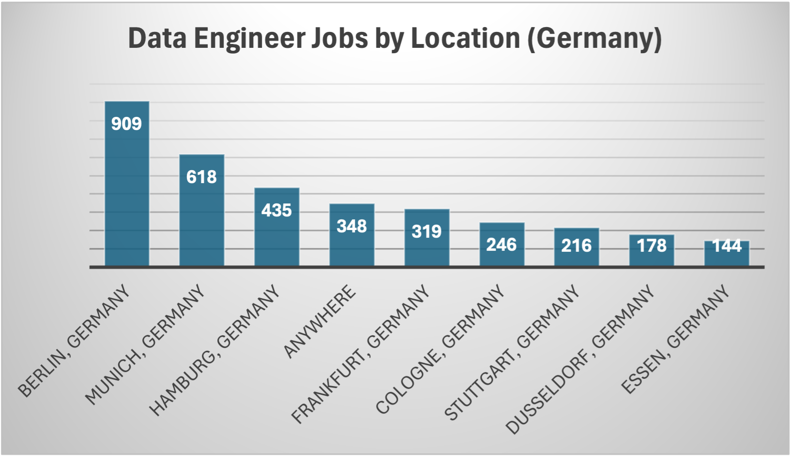

# SQL Project: Data Job Analysis

## Table of Contents
- [Introduction](#introduction)
- [Dataset Description](#dataset-description)
- [Tools Used](#tools-used)
- [Project Methodology](#project-methodology)
- [Analysis](#analysis)
- [Conclusion](#conclusion)
- [Contributing](#contributing) 

## Introduction
The project aims to analyze job data by extracting insights from a real-life dataset related to job postings. The goal of this project is to perform exploratory data analysis on a large job-related data using SQL. 

By analyzing the dataset, we aim to uncover trends, patterns, and insights that can provide valuable information primarily for job seekers such as top-paying skills, in-demand skills, high-demand jobs with a focus on Germany.

SQL queries used can be found here - [analysis_queries](/analysis_queries/)

## Dataset Description

The dataset represents  is sourced directly from the repository of  YouTuber [Luke Barousse](https://drive.google.com/drive/folders/1moeWYoUtUklJO6NJdWo9OV8zWjRn0rjN). A version of the dataset focussed on the US market can be found on [Kaggle]. 

For context, the data was collected from Google search results for job postings by country with s focus on data roles. The data collection involved connecting via python to an API in order to extract the data into a database. ([Kaggle Dataset](https://www.kaggle.com/datasets/lukebarousse/data-analyst-job-postings-google-search/data))

The dataset used in this project comprises of 4 csv files (or tables) covering the following details -
1. job_postings_fact - The fact table containing the core data to be utilized for the analysis including job titles, salaries, locations
2. company_dim - Dimension table containing company details; it is tied the job_postings_fact file with the job_id primary key
3. skills_job_dim - Dimension table containing the skill ids associated with each job id, linked by the job_id primary key
4. skills_dim - Dimension table containing corresponding skills associated with every skill_id.


## Tools Used

The following tools are utilized for the analysis - 
- Visual Studio Code - The IDE used for querying the dataset, performing intellgent analysis and pushing the code changes to Github
- SQL - The programming language used for interacting with a relational database
- PostgreSQL - The tables from the dataset are loaded onto the postgresql relational database management system
- Git - Version control system utilized for tracking changes in the code
- Github - The remote repository used for sharing the code, analyses and visualization


## Project Methodology

1. **Download data**: the CSV data files used for analysis was downloaded from Google Drive.
2. **Load Data**: The downloaded CSV files are loaded onto a PostegreSQL database from vscode. First, we create the database, followed by the table structure and then load the data into the database.   
3. **Queries**: Deep dive into understanding the database by asking key questions and query the database using SQL to generate insights.
4. **Push to Github**: Generate key output files and push the code onto Github 
5. **README.md**: Create Markdown file to describe the project and explain the analysis

## Analysis

In order to narrow the analysis, I focused on data engineer roles in Germany.

### 1. Top Locations for data jobs in Germany

To get a general understanding of the concentration of data engineer jobs in German cities, a simple query is run to obtain the no of jobs by job_location by utilizing the WHERE and GROUP BY clauses as given below -

```sql
SELECT job_location, COUNT(job_id) as no_of_jobs
FROM 
    job_postings_fact
WHERE
    job_country = 'Germany' AND
    job_title_short = 'Data Engineer'
GROUP BY
    job_location
ORDER BY
    no_of_jobs DESC
LIMIT 20;
```
The graphical representation of the results indicates that there is high concentration of data engineer jobs, as expected, in the top German cities. Berlin, being an international startup hub, leads the list, followed by Munich, Hamburg and Frankfurt. What's fascinating is the popularity of remote working among data engineering professionals, as indicated by the 'Anywhere' column in the graph.


*Column chart displaying popular data engineering job locations in Germany*

### 2. In-Demand Skills

To find the most demanded skills in the German market, I wrote an SQL query to get the count of skills by Data Engineer positions in Germany and sort by the skills count in descending order.

```sql
SELECT 
    skills_dim.skills,
    COUNT(job_postings_fact.job_id) AS skill_count
FROM job_postings_fact
INNER JOIN skills_job_dim ON job_postings_fact.job_id = skills_job_dim.job_id
INNER JOIN skills_dim ON skills_dim.skill_id = skills_job_dim.skill_id
WHERE 
    job_postings_fact.job_title_short = 'Data Engineer' AND
    job_postings_fact.job_location = 'Germany'
GROUP BY skills_dim.skills 
ORDER BY skill_count DESC
LIMIT 5;
```
The results obtained can be clearly visualized in the image below. It is important to note here that, apart from programming languages like python and sql, expertise in cloud technologies is what the market demands in data engineering. In tune with market, the top two cloud providers in demand are Azure and AWS. It is interesting to find that, in contrast to global trends where AWS is preferred, Azure stacks in Germany.


*Bar chart visualizing the most required data engineer skills in Germany*

### 3. Top Paying Jobs

The top paying jobs can be determined by left joining the fact table with the company_dim dimension table and filtering out only job which have salary NOT NULL.

```sql
SELECT
    company_dim.name AS company_name,
    job_title,
    job_title_short,
    job_location,
    job_schedule_type,
    salary_year_avg
FROM job_postings_fact
LEFT JOIN company_dim ON company_dim.company_id =  job_postings_fact.company_id
WHERE 
    job_title_short = 'Data Engineer' AND 
    job_country = 'Germany' AND
    salary_year_avg IS NOT NULL 
ORDER BY 
    salary_year_avg DESC
LIMIT 10;
```
A snapshot of the SQL query run (given below) giving the top 10 results shows a concentration of high salaries in Research Engineer jobs. It is no surprise that the companies offering such high paying jobs companies with wide global presence such as Bosch Group, TeamViewer and DENSO, some of which are even in the Global Fortune 500 firms. This indicates the advantage that industry heavyweights have in pulling in top talent.


**Note that this data has to be considered with a grain of salt as the salary data was provided only for a small proportion of companies*

### 4. Top Paying Skills

For this analysis, we consider the global data so that we get a better picture from a larger data range. For this analysis, two inner join operations are carried out from the fact table to the skills_job_dim and subsequently to the skills_dim dimension tables to extract the skills. 

```sql
SELECT 
    skills_dim.skills,
    ROUND(AVG(salary_year_avg)) AS avg_salary_skill
FROM job_postings_fact
INNER JOIN skills_job_dim ON job_postings_fact.job_id = skills_job_dim.job_id
INNER JOIN skills_dim ON skills_dim.skill_id = skills_job_dim.skill_id
WHERE 
    job_postings_fact.job_title_short = 'Data Engineer' AND
    salary_year_avg IS NOT NULL
GROUP BY skills_dim.skills
ORDER BY avg_salary_skill DESC
LIMIT 20;
```
To evaluate the results, I sidestepped the usual data analysis methods (such as Excel); I copy the results in json formay and feed in the data to chatgpt in order to offer some insights. Based on the provided data on top-paying skills for data engineer jobs, here are some insights summarized into three bullet points:

1. Demand for JavaScript and its Frameworks:

    Skills like Node.js and Vue.js (along with Next.js) are among the top-paying skills. This reflects the significant demand for engineers proficient in JavaScript and its associated frameworks, likely due to the widespread use of these technologies in web development and data engineering projects.
2. Database Expertise Remains Valuable:

    MongoDB (mongo) and Apache Cassandra are both database technologies highly valued in the market, as indicated by their relatively high average salary offerings. This suggests a continued need for professionals with expertise in NoSQL databases for handling large volumes of unstructured data efficiently.
3. Emerging Technologies Garnering Attention:

    Skills like Solidity (for blockchain development) and Rust (for systems programming) are also among the top-paying skills. This indicates a growing demand for professionals with expertise in emerging technologies such as blockchain and modern system programming languages, possibly driven by industries exploring innovative solutions and architectures.

## Conclusion
Through this project, we have gained valuable insights into the job market landscape based on the analysis of the provided dataset. These insights can be utilized by job seekers, employers, recruiters, and policymakers to make informed decisions regarding job search, recruitment, and workforce planning.
The results obtained from the SQL queries provide valuable insights into the job market, including:
- Geographic distribution of job opportunities
- Most in-demand job titles and skills
- Top companies hiring in the market

## Contributing
Contributions to this project are welcome. If you have any suggestions, improvements, or additional analyses to propose, feel free to submit a pull request. 

